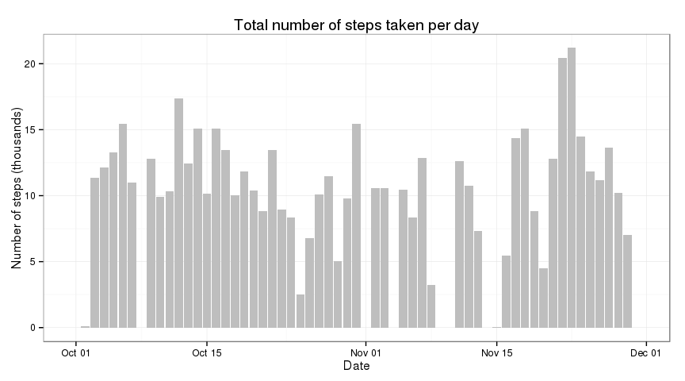
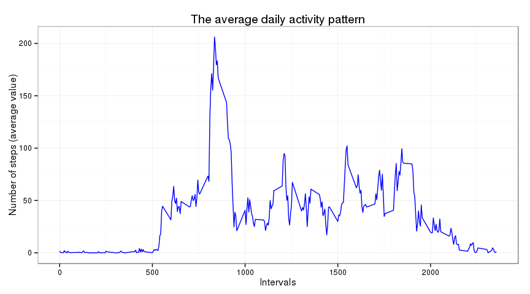
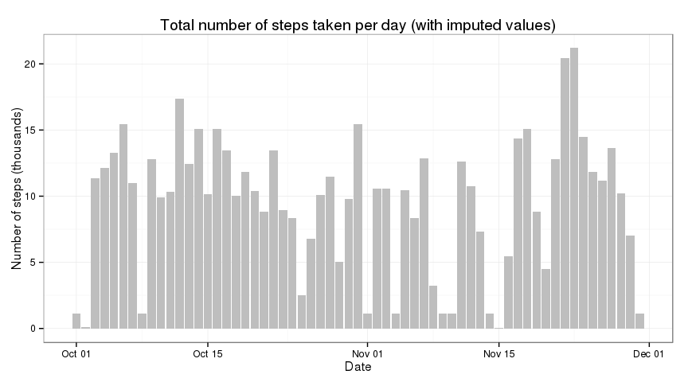
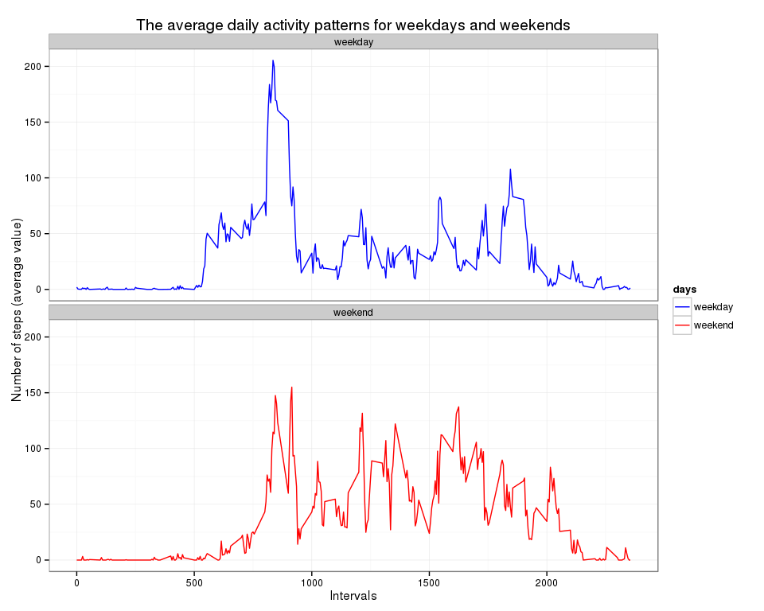

# Reproducible Research: Peer Assessment 1
Alexey Tkachev  


## Loading and preprocessing the data
We will use **dplyr** and **ggplot2** packages.  

```r
library(dplyr)
library(ggplot2)
```


```r
df <- read.csv("activity.csv")
df$date <- as.Date(df$date)
df <- tbl_df(df)
```


## What is mean total number of steps taken per day?
At the first step we calculate the total number of steps taken per day and make a histogram of the total number of steps taken each day.

```r
tmp <- summarize(group_by(df, date), s=sum(steps, na.rm = TRUE))
days <- length(tmp$date)
ggp <- ggplot(tmp, aes(x = date, y = s/1000))
ggp <- ggp + geom_histogram(fill="gray", color=NA, stat = "identity")
ggp <- ggp + theme_bw()
ggp <- ggp + labs(title="Total number of steps taken per day",
                  x="Date", y="Number of steps (thousands)")
```
 
 

Now we calculate the mean and median of the total number of steps taken per day.

```r
steps.mean <- mean(tmp$s)
steps.median <- median(tmp$s)
```
Mean - 9354.2295082  
Median - 10395  


## What is the average daily activity pattern?

```r
tmp <- summarize(group_by(df, interval), avg=mean(steps, na.rm = TRUE))
ggp <- ggplot(tmp, aes(x = interval, y = avg))
ggp <- ggp + geom_line(color="blue")
ggp <- ggp + theme_bw()
ggp <- ggp + labs(title="The average daily activity pattern",
                  x="Intervals", y="Number of steps (average value)")
```

 

Looking for a 5-minute interval, on average across all the days in the dataset, contains the maximum number of steps.


```r
int.max <- tmp$interval[which.max(tmp$avg)]
```
The interval that contains the maximum number of steps - 835  

## Imputing missing values
Now we will count the total number of missing values in the original dataset.

```r
missing.rows <- is.na(df$steps)
missing.count <- sum(missing.rows)
```
Total number of missing values - 2304  

For the missing values we will use the median for that 5-minute interval.  

```r
missing.rows <- which(missing.rows)
tmp <- summarize(group_by(df, interval), med=median(steps, na.rm = TRUE))
df.imp <- cbind(df, rep(tmp$med, days))
names(df.imp) <- c(names(df), "med")
df.imp$steps[missing.rows] <- df.imp$med[missing.rows]
df.imp <- select(df.imp, -med)

tmp <- summarize(group_by(df.imp, date), s=sum(steps, na.rm = TRUE))
ggp <- ggplot(tmp, aes(x = date, y = s/1000))
ggp <- ggp + geom_histogram(fill="gray", color=NA, stat = "identity")
ggp <- ggp + theme_bw()
ggp <- ggp + labs(title="Total number of steps taken per day (with imputed values)",
                  x="Date", y="Number of steps (thousands)")
```

 

Now we calculate the mean and median values with imputed data

```r
steps.mean.imp <- mean(tmp$s)
steps.median.imp <- median(tmp$s)
```
Mean with imputed data - 9503.8688525  
Median with imputed data - 10395 

## Are there differences in activity patterns between weekdays and weekends?
At the first step we create a new column with "weekday" and "weekend" values.

```r
we <- c('Sunday', 'Saturday')
days <- factor(c('weekday', 'weekend')[(weekdays(df.imp$date) %in% we) + 1L])
days.palette <- c('blue','red')
df.imp <- cbind(df.imp, days)
```

Next we make a plot of activity patterns in weekdays and weekends.


```r
tmp <- summarize(group_by(df.imp, days, interval), avg=mean(steps, na.rm = TRUE))
ggp <- ggplot(tmp, aes(x = interval, y = avg, colour = days))
ggp <- ggp + geom_line()
ggp <- ggp + scale_colour_manual(values=days.palette) 
ggp <- ggp + theme_bw()
ggp <- ggp + labs(title="The average daily activity patterns for weekdays and weekends",
                  x="Intervals", y="Number of steps (average value)")
ggp <- ggp + facet_wrap( ~ days, nrow = 2, ncol = 1)
```

 
